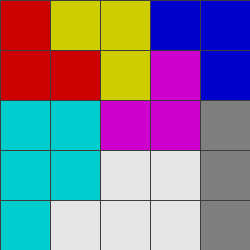

# IQ Puzzler Pro - Game Specification

<p align="center">
  
</p>

## Overview
IQ Puzzler Pro is a board game produced by Smart Games. The goal of the game is for the player to completely fill the board using the available puzzle pieces (blocks). This program tends to solve the game using brute force algorithm.

## Components
The key components of IQ Puzzler Pro include:

- **Board** – The main component of the game where players must place the puzzle blocks to fill the entire area.
- **Blocks/Pieces** – These are the puzzle pieces used to fill the board. Each block has a unique shape, and all blocks must be used to complete the puzzle.

## Gameplay
The game starts with an empty board. Players place puzzle blocks in such a way that no blocks overlap. Each puzzle block can be rotated and mirrored. The puzzle is considered solved only when the board is completely filled and all puzzle blocks have been placed correctly.


## How To Run
On your terminal, run this command
```bash
javac -d bin src/board/Board.java src/puzzlepieces/Piece.java src/readsave/ReadFromFile.java src/readsave/SaveToFile.java src/placingpuzzle/PlacingPuzzle.java src/generateimage/GenerateImage.java src/gui/Interface.java src/main.java

java -cp bin main                                                                                                                                                         
```

Make sure you have java installed on your device.
